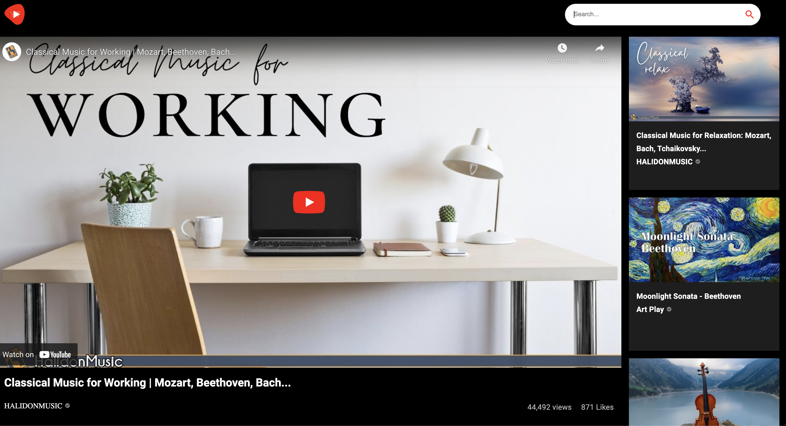
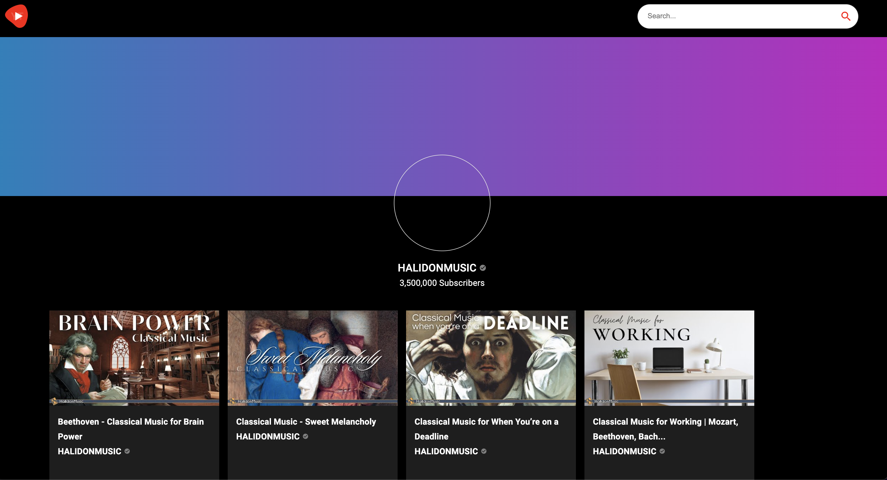

# Youtube_Clone

YouTube Clone Application in React JS with Material UI 5 | RapidAPI
Users can view and search youtube videos. Also they can view number of likes and views for each video.

## `Visit Youtube_Clone Online`
Youtube_Clone is live and online.
You can visit .... to view it.

# Getting Started

1. Clone the repo
3. cd and run npm install and then run npm start
4. Go to http://localhost:3000 in your browser

